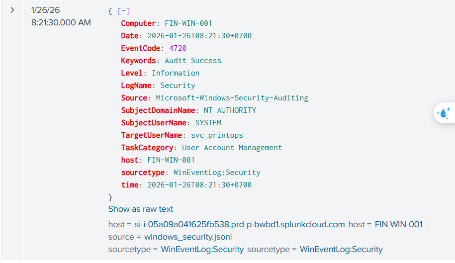
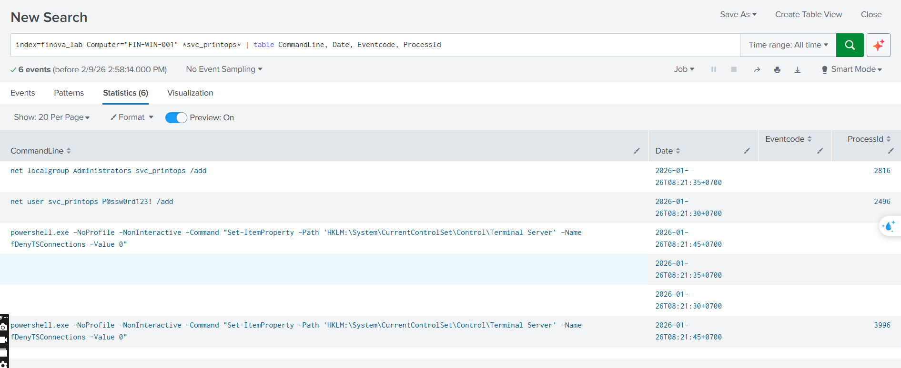
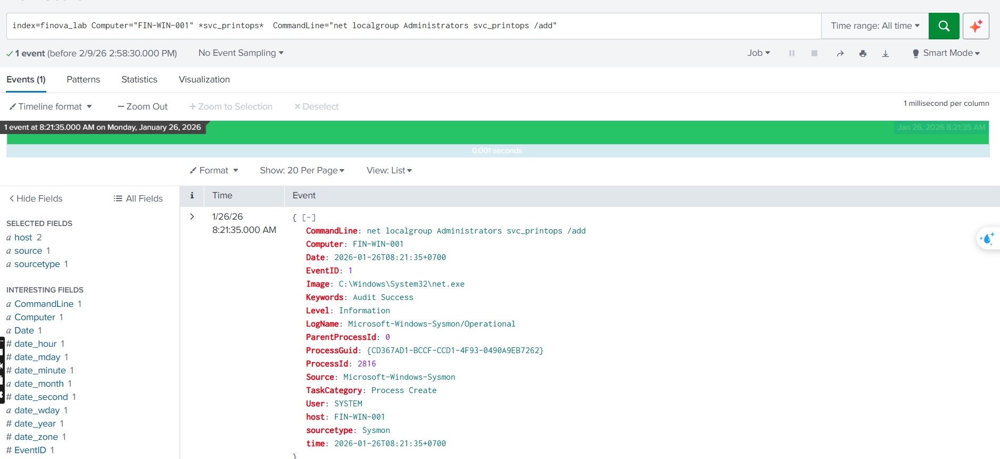
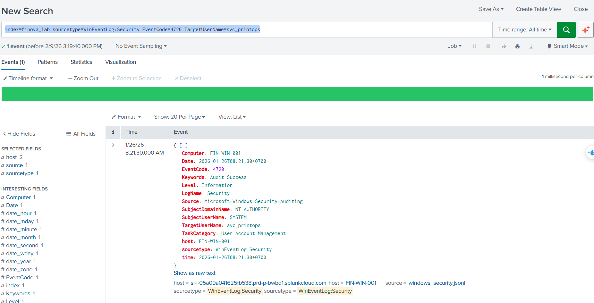
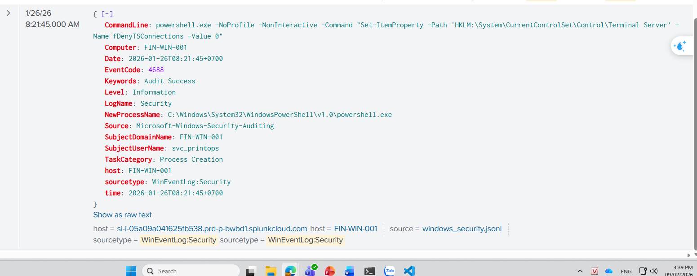
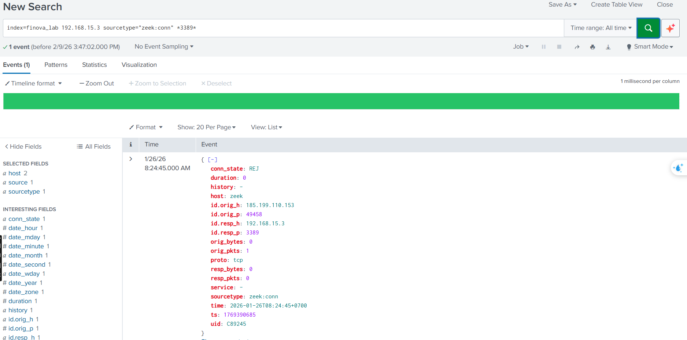
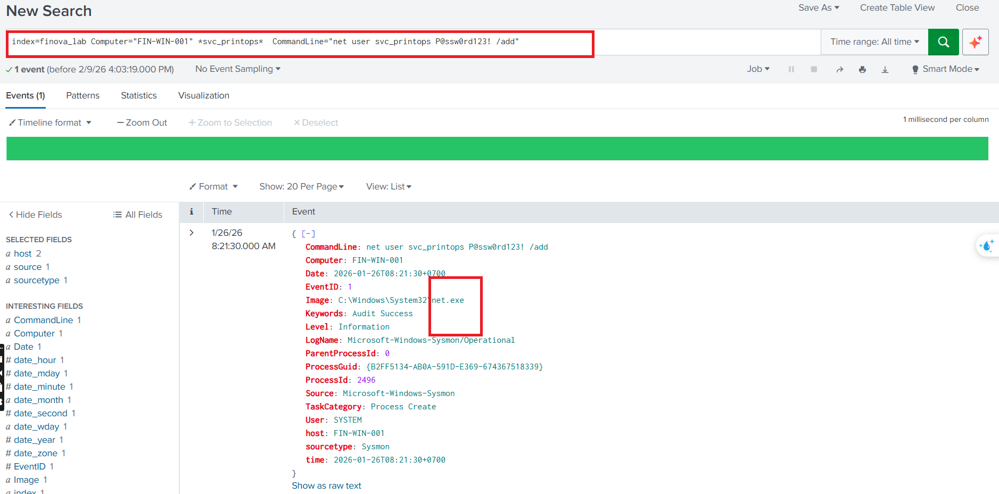
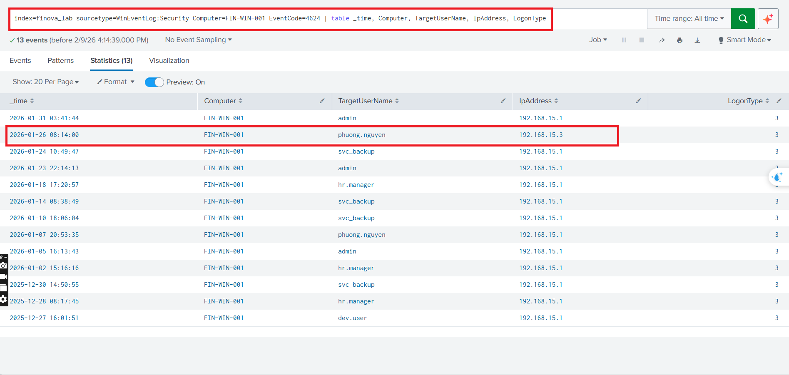

#                    SOC DAY 10
##                             
##
##
##
##
                    
## 9003 Alter type Privilege Escalation
- When :  Jan 23 2026 3h25 pm 
- Where, What : New local Admin  account created and adddeed to Admin group on  FIN -WIN -001, Event ID: 4732
- How: 
- Why : 
- Who : svc_printops, added administrator
### 1/18 Which account, which Hostname
query on Splunk with :  index=finova_lab Computer="FIN-WIN-001"           chọn 7 day/ All time

index=finova_lab Computer="FIN-WIN-001"

-  Chỉ tập trung vào request có dấu hiệu SQL Injection:
index=finova_web uri="* OR *"

### 2/18 hat process ID added the account to the Administrators group?
 - index=finova_lab Computer="FIN-WIN-001" *svc_printops* | table CommandLine, Date, Eventcode, ProcessId

### 3/18 When wwas account created 
index=finova_lab sourcetype=WinEventLog:Security EventCode=4720 TargetUserName=svc_printops

### 4/18
 index=finova_lab (sourcetype=Sysmon OR sourcetype=WinEventLog:Security) Computer=FIN-WIN-001 (User=* svc_printops * OR SubjectUserName=svc_printops)

C:\Windows\System32\WindowsPowerShell\v1.0\powershell.exe
- with commandline 

- NoProfile: không load profile user (tránh log, tránh hook)
- NonInteractive: chạy ngầm, không cần người dùng
- Set-ItemProperty: chỉnh Registry

### 5/18 Any connection attempt to host
- Yes
- From conn_Zeek
index=finova_lab 192.168.15.3 sourcetype="zeek:conn" *3389*

### 6/18 What process was used to create the account?
index=finova_lab Computer="FIN-WIN-001" *svc_printops* | table CommandLine, Date, Eventcode, ProcessId
- net.exe

 
### 7/18 Which user does this host belong to (at time of incident)?
- Câu này chưa hiểu, nhớ xem lại record 
- Phân tích lại từ đầu accident (tư duy)

- index=finova_lab sourcetype=WinEventLog:Security Computer=FIN-WIN-001 EventCode=4624 | table _time, Computer, TargetUserName, IpAddress, LogonType

### 8/18
### 9/18
### 10/18

 