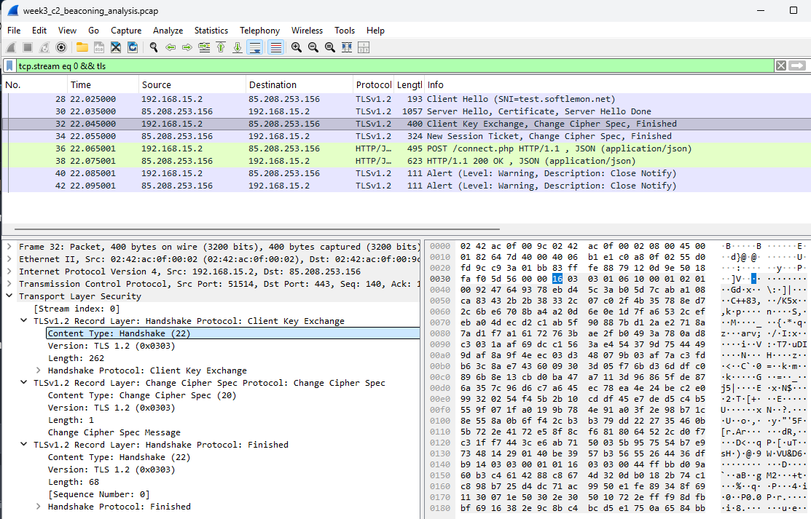
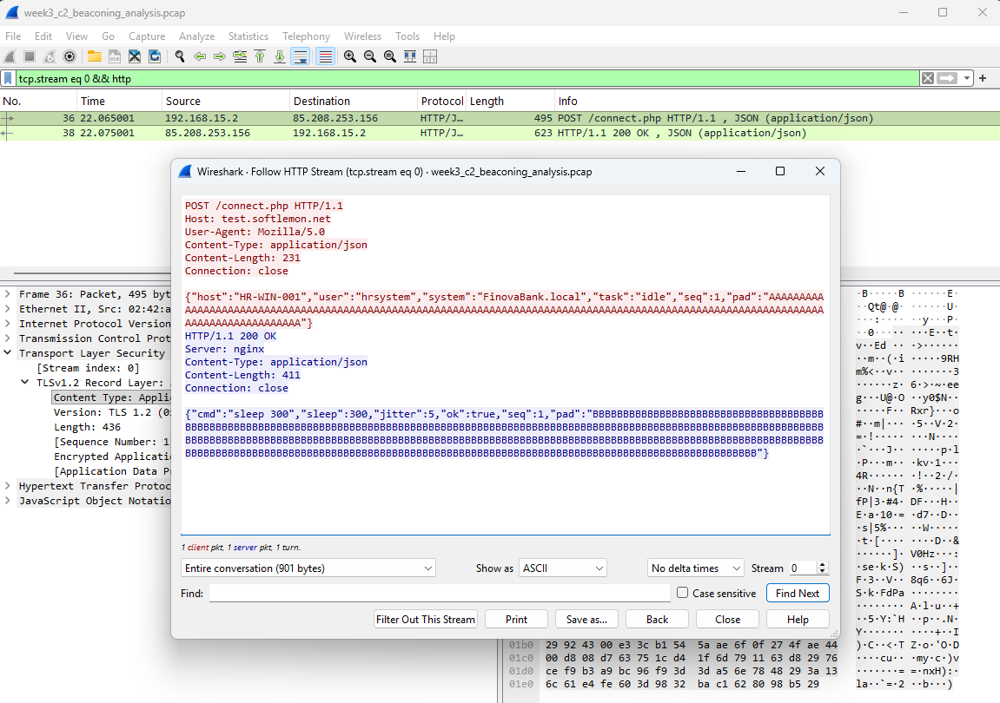

#       SOC Analysic buổi 4
## WIRESHARK VideoYOUTUBE chị BOW gửi

1. Tùy chỉnh file
    - Tạo ra nhiều profile với nhiều mục đích phân tích khác nhau

2.  Các trường thông tin của một gói tin
    - Xem, chụp được những thông tin 

3.  Packet filtering cơ bản
    - Lọc ra những thông tin cần thiết cho mục đích(ARP, HTTP, .........)

4. Flow TCP stream
    - Xem các thông tin hiện ra 

5. Thêm, xóa cột
    - Thêm, xóa ngoài những cột mặc định 

6. Display time format
    - Thay đổi thời gian mặc định

7.  Expert information
    - Thống kê, recommend những gói tin đáng chú ý
    - Nhìn vào đó phán đoán xem, focus on vào đâu

---------------------//---------------------------------------------------|
                   

## ĐỌC PCAP TRONG TRƯỜNG HỢP NÀO

1. PCAP 
     - Cho ta thấy packet theo thời gian (Client <-> Server)
     - Quá trình handshake/ Flags/ reset/ Retranmission
     - Payload (http, dns)

2. NOT 
     - Nội dung https/ TLS  (trừ khi đã giải mã)
     - Ý định người dùng (context)
     - Tiến trình trên máy process  (phải lên máy endpoint)

3. CẦN KHI
     - Chứng minh ALter(IP, blocked, impact,...)
     - Cần biết file tải về có hoàn chỉnh không
     - Cần hiểu protocol, pattern, (RST, retrry, beaconning,.....)
     - Trích xuất IOC: host, uri, cert nếu có 
     - Gửi gì ra ngoài
     - Thử lại session, confirm hoạt động đó là đe dọa, cần evident, ...

## WIRESHARK - Các filter thường dùng
1. ip.addr=192.168.1.1
     - hiển thị full packet liên quan đến IP này, bất kể nó là src or des
     - Xem connect nào vào, ra 
2. ip.src=192.168.1.2 && ip.des==8.8.8.8
     - Tìm đích danh kết nối
3. tcp.port==443
     - Nó đi nhiều quá thì lọc port
     - 0 quan tâm port nguồn hay port đích, miễn có port đó
4. .dns
     - traffic dns full
     - Coi thử máy đó query đến domain nào
     - ip đó liên quan đến domain nào
5. .http
     - Ở đây http đi bất kì port nào 0 riêng j 80
     - request, respone, server
     - File, đường dẫn, GET, POST, PUT
6. tcp.stream eq 7
     - 1 cụm packet gọi là stream trên PCAP
     -  ở đây là cụm stream thứ 7
7. tcp.flags.reset==1
     - App chết, đóng kết nối đột ngột
     - Server ngắt, server chặn port
8. frame.time >="Oct 10, 2025 08:00:00
     - <=
     - Bỏ thời gian cũng được
9. http.request.method=="POST"
      - tìm theo method POST, PUT, GET, .......
     - Chỉ đọc được khi không được mã hóa, nhưng thường thì mã hóa, cần key
     - NẾu encrypt thì không đọc được, nói ở dưới 
10.   EXAMPLE
       -  192.168.1.1  và 192.168.1.15  port 443
       - Chỉ hiển thị các packet được decode TLS/SSL
       - packet có TCP RST (reset) để xem có bị chặn hay cắt phiên hay không
       - ANSWER:  ipddr=192.168.1.1 && ip.addr==192.168.1.15
       - &&tcp.port==443 && (tls||ssl)
       - &&tcp.flags.reset==1
       - Nếu or giữa 2 IP thì chỉ đúng 1 IP, 

---------------------------------------||----------------------------------------
## SOC 301

---------------------------------------||---------------------------------------
1. What is the domain related to the beaconing activity?
      - Query IP
      - dns&&dns.a==85.208.253.156
      - Tab domain name system (resonse)
      - test.softlemon.net
2. bắt tay thành công
      - chuột phải - flow - flow stream
      - Khi gửi đi TLS / handshake
      - ở đây nó lấy cái cert nó đi encrypt
      - cần cái key, tải trên Discord  (private key và sesion key ) BTVN
      - Xem quá trình bắt tay https://www.cloudflare.com/learning/ssl/what-happens-in-a-tls-handshake/
      - Import key: edit - refreence - RSA - Apply- OK
3. tìm tcp.stream eq 0 && tls
      - 
      
      
      - Dòng 30, 32 server gửi
      - Bước 3: TLS handshake nó gửi ngược về server
      - TLS handshake successfull
4. What is the HTTP method used in the first TCP beaconing stream ?
      - tcp.stream eq 0 && http
      - hoặc tìm TLS trong đống bùi nhùi nếu chưa filter
      - chuột phải - flow
      - Đỏ user gửi ra, xanh server gửi về
      - 
5. context sent là file json, 
6. context received.........
7. True positive
      - Nếu ko có fw xịn để inspect TLS
      - Trong thực tế vào máy user để lấy cái key để decryption
      - Nếu không có PCAP thì phải vào server capture trsfffic 
      - check domain name trên virustotal- đọc community

## SOC 302
Suspicious download update.exe
1. soft.update-app.net
      - PCAP này đã được Filter 
      - Asset là source
      - Đỏ mình gửi đi, xanh server respon vể 
3. content length
4. làm sao biết nó tải được bao nhiêu trước khi bị blocked
     - FW xịn nên filter được 
     - Statictis B -> A 150kB
5. TCP RST packets from firewall/IDS
     - Cơ chế nào để chặn download 
     - SErver nó đứng giữa nó gửi ra rằng tao ko nhận nữa thay cho user
     - file PCAP là mazic number 
7. Threat intelligence 
     - nội bộ của mình chính xác nhất
     - domain malicious
     - cách 2: check endpoint  -> 1 đống câu hỏi
     - -nếu nó tải file thành công thì "file" -> export Objects -> http

------------------------------//-------------------------------------------| 

## HOME WORK
1. Giả sủ có quyền remote vào máy user Windows, làm cách nào để tôi lấy được key để mã hóa encrypted traffic (TLS/SSL) trong quá trình bắt tay ba bước 
    - Nguyên tắc TLS/SSL không thể bị bẻ khóa trong quá trình bắt tay nếu không có private key và không lấy được session key tại endpoint vì vậy khi có quyền remote vào endpoint ta lấy TLS session key bằng SSLKEYLOGFILE
    - ở đây ghi lại session key trên Client
    - Wireshark dùng key này để decrypt traffic
    - trong terminal:   setx SSLKEYLOGFILE "C:\temp\tls_keys.log"
    - file này chứa session keys
    - Edit - Preferences - Protocols - TLS
    - Chọn file - Apply - OK

  Sau đó ta thấy

    - HTTP payload
    - URL, Header, Body
    - C2 traffic nếu là malware
    - File exfiltration

