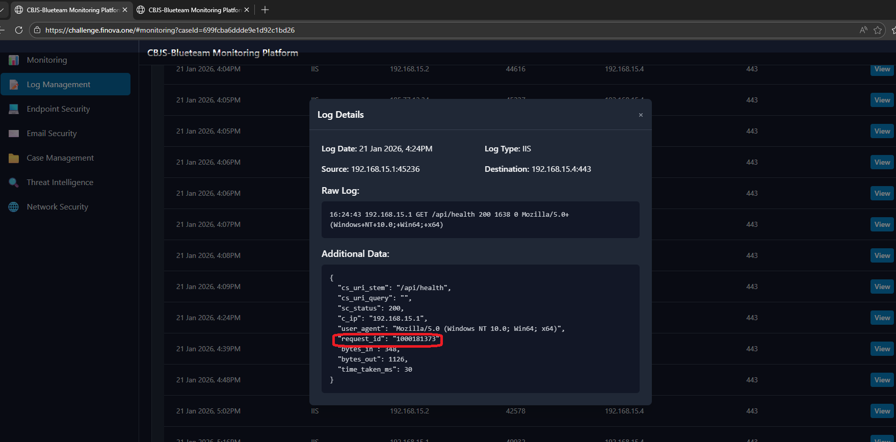
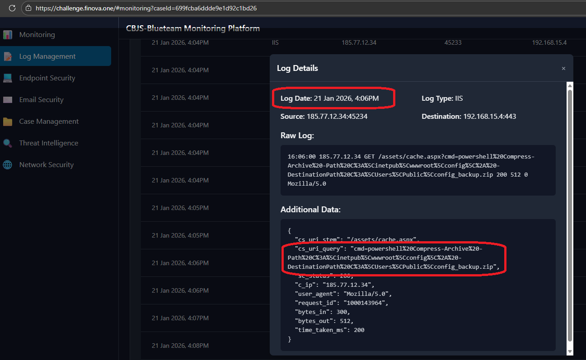
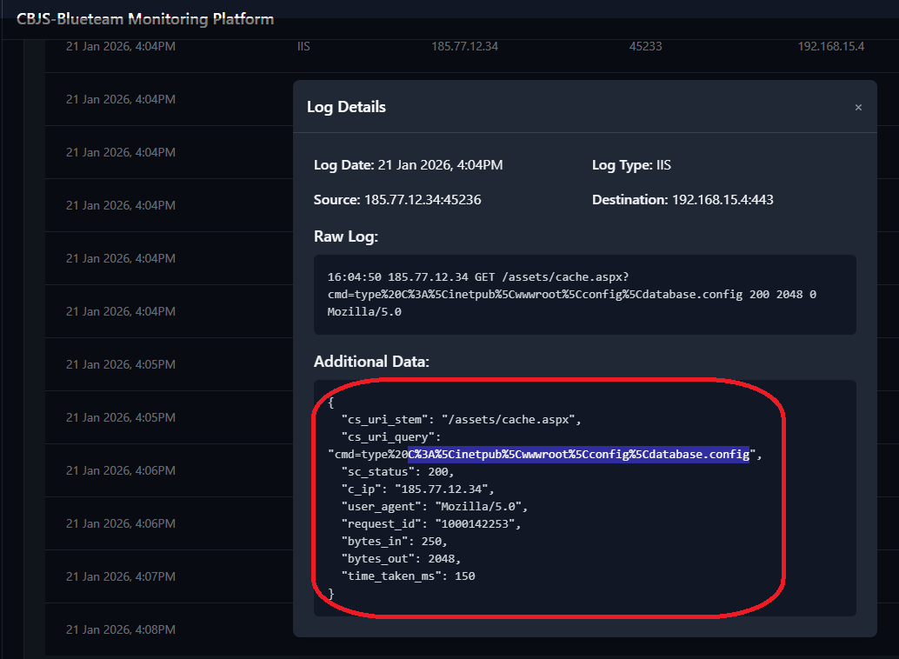
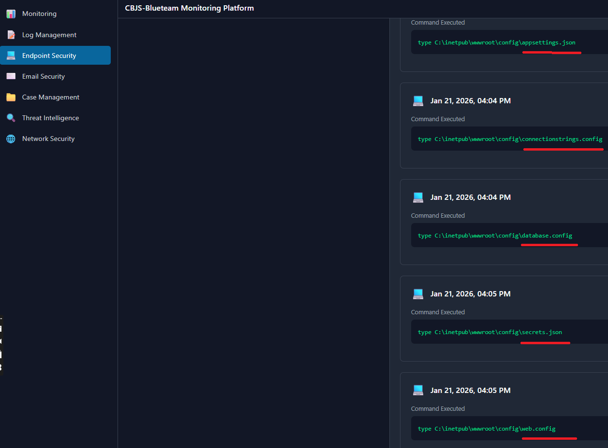
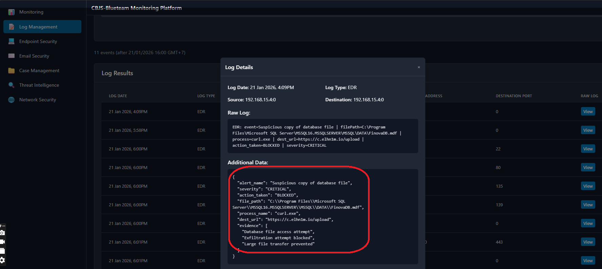

#                    Challenge 7001
##                             
##
##
##
##
                    
## 10/16 What is the IIS request ID for the directory listing command that discovered the database file?
- Research: IIS, destinastion 192.168.15.4, 04h8pm Jan 21 2026

- Answer: 1000145302

## 11/16 Earlier in the attack chain, what PowerShell command was used to create a zip archive?
-  
Compress-Archive -Path C:\inetpub\wwwroot\config\* -DestinationPath C:\Users\Public\config_backup.zip
- Explain: Dựa vào Log IIS lúc 16h06 ngày 21/01/2026, ta có thể thấy được command mà attacker đang sử dụng.

## 12/16 INVESTIGATION: What directory was explored before the zip file was created? Check IIS logs for directory listing commands.
- %3A  :
- %20 khoảng trắng
- %5C  \
- %2A  *
- cmd=type%20C%3A%5Cinetpub%5Cwwwroot%5Cconfig%5Cdatabase.config

Answer: C:\inetpub\wwwroot\config

Dựa vào Log IIS lúc 16h04 21/01/2026, ta có thể thấy được command mà attacker đang sử dụng.

## 13/16 INVESTIGATION: What files were collected and exfiltrated in the config_backup.zip? List all filenames in alphabetical order, separated by commas.(Liệt kê tất cả tên tập tin theo thứ tự bảng chữ cái, phân cách bằng dấu phẩy.)

- Dựa vào Log ở Endpoint, Attacker collected file sau đó zip lại
- Lưu ý : Investigate how the exfiltration command was executed. Review earlier activity and analyze network traffic to identify what data was collected and exfiltrated. 
- 
## 14/16 IOC: Was the database file exfiltration attempt successful or blocked?
*Suggested tool: EDR Analysis*
- Dựa vào logs EDR ở lúc 16h09pm , 21/01/2026, ta có thể thấy được "action_token: blocked"   
- Answer: BLOCKED  _   EDR successfully blocked the database file exfiltration attempt before data could be transferred.
    - 

## 15/16 ASSESSMENT: Based on your investigation, what is your final assessment of this alert?
- Ta kết luận được rằng:  True Positive - Blocked Database Exfiltration Attempt

Explanation:
All evidence confirms a real attack that was successfully prevented.

## 16/16 
    