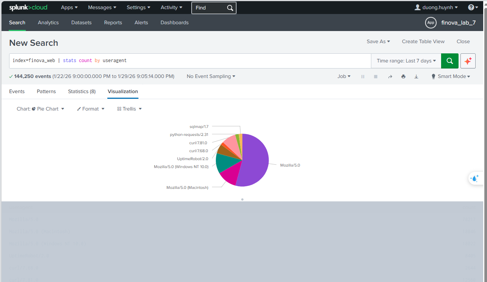

#                    SOC DAY 9
##                             Splunk
                           
### 1. Các phương pháp phát hiện                  
#### 1.1. Rule - based Detection (Phát hiện dựa trên luật)


- Phát hiện dựa trên hành vi đã biết và mẫu tấn công có sẵn (known patterns)
- SOC phát hiện nhanh, chính xác nếu rule tốt
- Phù hợp các attack quen thuộc SQL injection, brute force, scan, malware known IOC, ....
##### Trong thực tế :
- Đây là cốt yếu của SIEM
- Dựa trên Signature, regex, threshold, correlation
##### Example:SQL Injection Attempt
index=finova_web uri="* OR * 1=1 *"
| stats count by src_ip
| where count > 5
#### 1.2. Anomaly-based Detection (Phát hiện bất thường)
- Tập trung vào hành vi hiếm or khác baseline
- Dùng để phát hiện attack mới, chưa có Signature
- Mạnh nhưng khó vân hành vì dễ sinh noise
##### Example: login at Unusual Hours
 index=finova_auth action=login_success
 | eval hour=strftime(_time, " %H ")
 | where hour < 6 OR hour > 22
| stats count by user, src_ip, hour
- User đăng nhập ngoài h hành chính 
- Risk signal , cần correlate thêm: IP, endpoint, User privilege
- Đây là kiểu phát hiện dựa trên hành vi thường dùng cho: Account compromise, Inside threat, APT stealthy
#### 1.3. Operation Considerations - Vân hành thực tế 
- Rule-Based: nhẹ, hiệu quả, ít tốn tài nguyên 
- Anomaly-based: tốn công tunnning, tốn resource

#### 2. Detection Lifecycle - Vòng đời một detection
##### 2.1. Business Concern - Why
- Vấn đề kinh doanh 
- Vấn đề an ninh 
##### 2.2. 
##### 2.3. 
##### 2.4. 
##### 2.5. 
#### 3. Common Pitfall in Dectetion - Những lỗi SOC thường gặp 
#### 4. Whitelisting & Threathold - SPL Examples
#### 5. Why Writing Detection Is Still Hard
#### 6. Detection Principles Overview
#### 7. Những điểm nút quan trọng
#### LAB Splunk 
##### bài 1:
**Bước 1 – Truy vấn để khám phát dữ liệu Web**

```latex
index=finova_web
| stats count by clientip
| sort -count
```

```latex
index=finova_web
| stats count by useragent
```
